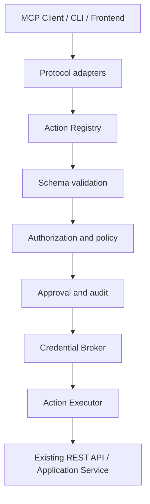
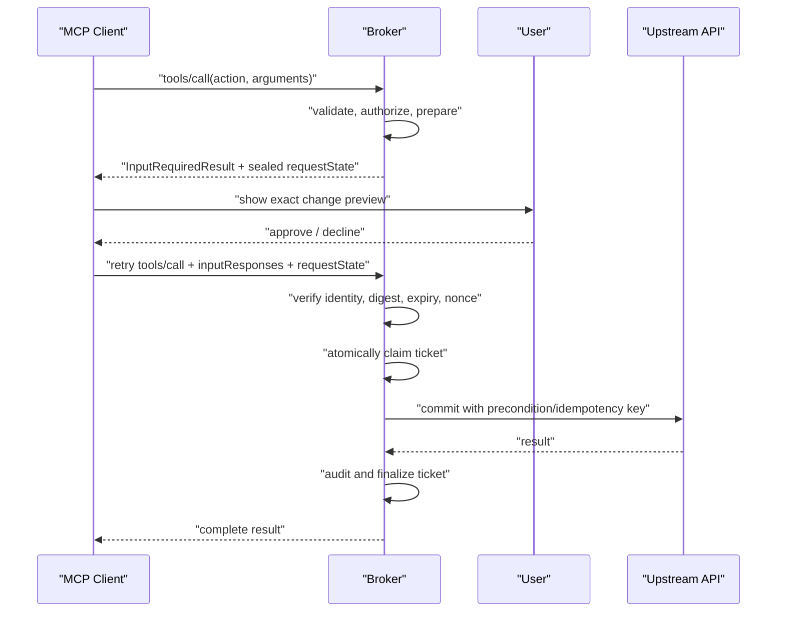

# api-cli Capability Broker 実装計画

## 1. 目的

`api-cli` を、既存のREST APIを任意に呼び出すCLIから、認証情報をAIへ渡さず、許可された操作だけをポリシー・承認・監査付きで公開するLocal-first Agent Capability Gatewayへ段階移行する。

移行後の中心はCLIやMCPではなく、操作の意味・入出力・実行先・必要権限・危険度を表す `ActionDefinition` とする。

```text
ActionDefinition
├── CLI adapter
├── MCP adapter
└── REST / Application adapter
```

既存の `api-cli api call` は人間向けのデバッグ経路として当面維持するが、MCP Toolとしては公開しない。

## 2. 計画のステータス

- 対象ブランチ: `main`
- ベースラインコミット: `db3a6ee8477066f394ce457e79067637d45786b8`
- 実装バージョン: `0.2.0`
- 計画対象: `0.1.x`から`0.4`まで
- 計画更新条件:
  - MCP仕様または`rmcp`の互換性方針が変わった場合
  - ActionDefinitionの公開形式を変更する場合
  - Remote MCPの認証方式を変更する場合

### 2.1 2026-07-29 実装状況

今回の実装で完了:

- OAuth PKCE callbackの動的port一致、state/error/code検証、timeout、mock E2E
- HTTP timeout、streaming byte上限、error body上限、same-origin redirect、HTTPS/private egress制約
- API KeyのBearer/custom header切り替え
- metadata/vault migration runnerと未対応version拒否
- `ActionDefinition apicli.dev/v1alpha1`、fail-closed Registry、JSON Schema入出力検証、masking
- OpenAPI 3 `operationId` import（無効draft、parameter location、scope候補、外部ref/callback/webhook拒否）
- CLI `action validate/list/describe/run/prepare/approve` と `openapi validate/import`
- `rmcp 3.0.0`によるMCP 2026-07-28 stdio、Tool Schema、MRTR
- RFC 8785 JCS digestに結び付いた永続・期限付き・一回限りの承認ticket
- Action version、definition、全引数、provider、policy、principal、tenant、client binding
- `executing`から`succeeded/failed/unknown`への状態遷移、timeout/cancellation時のunknown化
- ETag `If-Match`、上流idempotency header、秘密を保存しない監査ログ
- OAuth introspection保護Streamable HTTP、audience/subject/tenant/client/scope検証
- scope別Tool一覧、credentialとMCP sessionのprincipal/tenant分離
- Origin/Host/CORS、同時実行数、session数、HTTP request bodyサイズ制限

安全のため未公開・継続対象:

- Remote writeはBroker自身の認証済み承認ページを実装するまでTool一覧から除外する。
- Remote principal用の外部OAuth URL elicitationとcredential接続作成UIは未実装。
- Vault master keyのOS Keychain/Credential Manager/Secret ServiceまたはKMS wrappingは未実装。
- 監査ログ閲覧API、外部approval UI、分散session store、運用rate limitは未実装。

## 3. 到達点



到達点では以下を満たす。

1. AIは任意のHTTP method・path・bodyを指定できない。
2. 外部APIのアクセストークンやAPIキーはMCPクライアントへ返さない。
3. Broker用の認証情報と外部API用の認証情報を分離する。
4. Tool一覧は、認証済み主体、scope、tenant、プロトコル能力に応じて絞り込む。
5. 全入力をスキーマ検証し、全出力にサイズ制限とマスキングを適用する。
6. 書き込みはポリシー評価と承認を通し、承認対象と実行内容を暗号学的に結び付ける。
7. 書き込み結果が不明な場合に、無条件で自動再試行しない。
8. 操作主体、Action、承認、実行結果を、秘密情報を残さず監査できる。

## 4. 非目標

以下は少なくとも`0.4`までは対象外とする。

- REST APIそのものの廃止
- 任意のOpenAPIドキュメントを無審査で全Tool化すること
- 外部APIが提供しない冪等性やトランザクションをBrokerだけで完全に保証すること
- 独自OAuth Authorization Serverの新規実装
- RustプロセスからTypeScript/HonoのApplication Serviceを直接インプロセス実行すること
- 汎用ワークフローエンジン、プラグインランタイム、分散ジョブ基盤
- Tool descriptionやMCP clientInfoを認可根拠として信用すること

## 5. セキュリティ不変条件

実装中も次の条件を破らない。

- `api_call(provider, method, path, body)`をMCPへ公開しない。
- inboundのBroker tokenを外部APIへ転送しない。
- principal、tenant、client IDは、remoteでは検証済みトークンから導出する。
- local stdioでは、Tool引数として渡されたuser IDを認可根拠にしない。
- ActionDefinitionに存在しない操作をAction Executorから実行しない。
- 書き込みの承認は、Action名だけでなく正規化済み全引数と実行先に結び付ける。
- 承認チケットは期限付き・一回限りとし、消費を原子的に行う。
- レスポンスは上限確認前に全体をメモリへ読み込まない。
- エラーレスポンスにも通常レスポンスと同じサイズ制限・マスキングを適用する。
- remoteでは、MCPクライアントの「承認済み」という申告だけを承認の証明にしない。
- 秘密情報、アクセストークン、生のAPIキーを監査ログへ記録しない。

## 6. バージョン別ロードマップ

| バージョン | 目的 | 主な成果物 | 次へ進む条件 |
|---|---|---|---|
| `0.1.1` | 現行基盤の安定化 | OAuth修正、HTTP制限、DB migration、回帰テスト | 現行CLIが維持され、OAuth E2EとHTTP上限テストが成功 |
| `0.2` | AIから安全に読める | ActionDefinition、OpenAPI import、`rmcp`、read-only Tools | MCP相互運用、schema、allowlist、maskingが検証済み |
| `0.3` | AIが承認付きで変更できる | Policy Engine、承認チケット、MRTR、監査、write executor | 引数改変・replay・別ユーザー利用を拒否できる |
| `0.4` | 外部公開できる | Streamable HTTP、OAuth Resource Server、tenant分離、SSRF対策 | cross-tenant、audience、token passthrough、egress試験が成功 |

## 7. Phase 0: `0.1.1` 現行基盤の安定化

### 7.1 変更前ベースライン

実装前に以下をCIの基準として固定する。

```bash
cargo fmt --all -- --check
cargo clippy --all-targets --all-features -- -D warnings
cargo test --all-targets
cargo build --release
```

追加するベースライン試験:

- provider add/list/remove
- API Key loginと暗号化保存
- OAuth refresh
- CLI `api call`のGET/POST
- stdioで現在の独自JSON-RPCがどのように失敗するかを示す回帰試験
- 現行DBから新バージョンを起動できるmigration試験

### 7.2 OAuth PKCE callbackの修正

現状は認可URLとtoken exchangeが `127.0.0.1:8080` を使う一方、callback serverはランダムポートへbindしている。次の順序に変更する。

1. callback listenerを先にbindする。
2. 実際にbindされたポートからredirect URIを生成する。
3. 同じredirect URIをauthorization requestとtoken exchangeの両方に使う。
4. 固定ポートしか受け付けないprovider向けに、provider設定で固定ポートを指定可能にする。
5. callback待機に期限を設ける。
6. OAuth error response、state欠落、code欠落を成功扱いしない。
7. ブラウザ自動起動を実装するか、READMEを「URLを表示する」に修正する。

完了条件:

- mock OAuth serverを使った認可コード交換のE2Eテストが成功する。
- authorization requestとtoken requestのredirect URIが完全一致する。
- state不一致、期限切れ、code欠落を拒否する。

### 7.3 HTTP Executorの防御

`ApiApp`に共通の実行制約を導入する。

- connect timeout
- request timeout
- response byte上限
- error body byte上限
- redirect回数とredirect先検証
- productionでのHTTPS必須化
- provider base URLの正規化
- private、loopback、link-local宛て通信の明示的な許可設定
- `Content-Length`事前検査とstreaming中の実測上限
- response content typeの記録
- Authorization headerをエラーメッセージやログへ含めない

API Key方式は少なくとも次を区別する。

```rust
enum CredentialPlacement {
    Bearer,
    Header { name: String },
}
```

query parameterでのAPI Key送信は、漏えいリスクが高いため初期実装には含めない。

完了条件:

- 上限を超えるchunked responseを途中で停止する。
- redirectを利用した許可外hostへの遷移を拒否する。
- timeoutとresponse-too-largeを型付きエラーとして区別できる。
- 既存のBearer API Key設定は移行後も動作する。

### 7.4 DB migration基盤

既存の `schema_version` テーブルを実際のmigration runnerへ接続する。

- migrationは昇順・一回限りで適用する。
- migration全体をtransactionで処理する。
- 未対応の新しいschema versionを古いバイナリで開かない。
- 空DB、現行DB、途中失敗後の再起動を試験する。

### 7.5 Phase 0の成果物

- OAuth callback修正
- HTTP execution constraints
- credential placement
- migration runner
- mock OAuth E2E fixture
- oversized/slow/redirecting HTTP fixture
- READMEと現行挙動の整合

## 8. Phase 1: `0.2` ActionDefinitionと実行コア

### 8.1 ActionDefinition v1alpha1

初期形式はYAMLまたはJSONとし、同じserde modelへ読み込む。

```yaml
api_version: apicli.dev/v1alpha1
kind: Action

metadata:
  name: customer.get
  version: 1
  description: 顧客情報を取得する

spec:
  input_schema:
    type: object
    additionalProperties: false
    properties:
      customer_id:
        type: string
        minLength: 1
    required: [customer_id]

  output_schema:
    type: object
    properties:
      customer_id:
        type: string
      display_name:
        type: string
    required: [customer_id]

  executor:
    kind: openapi
    provider: crm
    operation_id: getCustomer

  risk: read
  approval: never

  broker_scopes:
    - customer:read

  upstream_scopes:
    - crm.customer.read

  constraints:
    timeout_ms: 10000
    max_response_bytes: 1048576
    response_mask:
      - /email
      - /phone
```

初期のrisk:

```rust
enum RiskLevel {
    Read,
    ReversibleWrite,
    Destructive,
    Privileged,
}
```

初期のapproval policy:

```rust
enum ApprovalMode {
    Never,
    Always,
    Policy,
}
```

提案ファイル構成:

```text
src/
  domain/
    action.rs
    policy.rs
  app/
    action.rs
  infra/
    action_loader.rs
    schema.rs
    openapi.rs
```

### 8.2 Schema処理

- `input_schema`のrootはobjectに限定する。
- JSON Schema 2020-12を基準にする。
- 外部URLの `$ref` は解決しない。
- schema document size、参照深さ、検証時間に上限を置く。
- `additionalProperties`の既定方針を明文化する。
- 実行前にinput、実行後にoutputを検証する。
- 出力違反は上流レスポンスをそのままAIへ返さず、型付きエラーと監査イベントにする。

### 8.3 Action Registry

Action Registryは次を保証する。

- Action名の一意性
- Action versionの単調増加
- 同名同versionの内容ハッシュ一致
- deterministicな一覧順序
- 起動時の全定義検証
- 無効なActionが1つあった場合のfail-closed
- enabled/disabledの明示
- source pathとdefinition digestの記録

初期の配置先:

```text
<api-cli config dir>/
  actions.d/
    *.yaml
```

ActionDefinitionは読み込み専用として扱い、Tool呼び出しから追加・変更させない。

### 8.4 Executor抽象化

```rust
trait ActionExecutor {
    async fn prepare(&self, context: &ActionContext, input: Value)
        -> Result<PreparedAction>;

    async fn commit(&self, prepared: PreparedAction)
        -> Result<ActionResult>;
}
```

read Actionでも同じ経路を通す。`prepare`は以下を確定する。

- providerと外部接続先
- 正規化済み引数
- method、path、query、body
- 必要scope
- timeoutとresponse上限
- masking rule
- writeの場合は変更previewとprecondition

外部HTTP実行は `OpenApiExecutor` が担当し、MCP adapterから `ApiApp::call` を直接呼ばない。

### 8.5 OpenAPI importer

コマンド案:

```bash
api-cli openapi validate ./openapi.yaml
api-cli openapi import ./openapi.yaml --provider crm --output ./actions.d
```

importerの規則:

- `operationId`がある操作だけを自動候補化する。
- `operationId`がない操作は警告し、自動公開しない。
- import結果は必ず `enabled: false` のdraftにする。
- security requirementsを `upstream_scopes` の候補へ変換する。
- request parameterのlocationを保持する。
- 複数success responseがある場合の選択規則を明示する。
- unsupported schema、callback、webhook、外部 `$ref` はfail-closedにする。
- importは既存Actionを暗黙に上書きしない。

完了条件:

- 同じOpenAPIから常に同じ順序・同じdigestのdraftを生成する。
- allowlistで有効化したoperationだけがRegistryへ入る。
- operationId重複、欠落、未解決 `$ref` を検出する。

### 8.6 CLI adapter

追加コマンド案:

```bash
api-cli action validate
api-cli action list
api-cli action describe customer.get
api-cli action run customer.get --input '{"customer_id":"c_123"}'
```

`action run`もschema、policy、masking、auditを通す。既存の `api call` は互換維持のため残すが、ヘルプ上でdebug/unsafe経路であることを明示する。

## 9. Phase 2: `0.2` read-only MCP

### 9.1 `rmcp`移行

手書きJSON-RPCを公式Rust SDKへ置き換える。

対象:

- MCP 2026-07-28の`server/discover`
- 旧仕様向け`initialize`
- `tools/list`
- `tools/call`
- Tool input/output schema
- stdio transport
- capability negotiation
- JSON-RPC標準error code
- cancellation

SDKの互換層を利用し、独自にプロトコル分岐を再実装しない。

### 9.2 Tool公開規則

`0.2`では次をすべて満たすActionだけを公開する。

- `enabled: true`
- `risk: read`
- `approval: never`またはread用policyで許可
- principalが `broker_scopes` を満たす
- provider credentialが存在する
- definitionとschemaが有効

`api_call`とprovider管理操作はTool化しない。

`tools/list`はAction名でdeterministicに並べる。Tool一覧が認証scopeによって異なる場合は、キャッシュ境界がprincipalをまたがないようにする。

### 9.3 実行pipeline

```mermaid
flowchart LR
    A["tools/call"] --> B["Resolve principal"]
    B --> C["Find Action"]
    C --> D["Validate input"]
    D --> E["Authorize scopes"]
    E --> F["Prepare execution"]
    F --> G["Execute HTTP"]
    G --> H["Enforce byte limit"]
    H --> I["Validate output"]
    I --> J["Mask fields"]
    J --> K["Audit"]
    K --> L["Tool result"]
```



### 9.4 read-only監査

`0.2`から最低限の監査を開始する。

- event ID
- timestamp
- local/remote mode
- principal ID
- Action名とversion
- provider/connection ID
- definition digest
- input digest
- outcome
- duration
- response bytes
- error category

生の入力・出力は既定で保存しない。必要な安全フィールドだけActionDefinitionで明示的に許可する。

### 9.5 MCP検証

自動試験:

- `server/discover`成功
- legacy `initialize`成功
- `tools/list`にread Actionのみが現れる
- `tools/call`の正常系
- unknown Tool
- schema不正
- output schema違反
- scope不足
- credential不足
- timeout
- oversized response
- masking
- cancellation
- stdoutへMCP以外の内容が混入しない

手動検証:

- MCP Inspector
- 少なくとも2種類のMCP host
- 2026-07-28対応client
- legacy client

Phase 2完了条件:

- read-only ActionをCLIとMCPの両方から同じ結果・同じpolicyで実行できる。
- 汎用REST Toolが公開されない。
- 仕様違反リクエストがJSON-RPC/MCPの適切なエラーになる。
- 全Tool入力と構造化出力がschema検証される。

## 10. Phase 3: `0.3` 承認付きwrite

### 10.1 Policy Engine

Policyの入力:

- verified principal
- tenant
- MCP client IDまたはlocal execution context
- Action名・version・definition digest
- risk
- normalized arguments
- provider/connection
- broker scopes
- upstream scopes
- 現在時刻
- resource precondition

Policyの出力:

```rust
enum PolicyDecision {
    Allow,
    RequireApproval { reason: String },
    Deny { reason: String },
}
```

初期既定値:

| risk | local stdio | remote |
|---|---|---|
| read | allow | allow if scoped |
| reversible-write | require approval | require authenticated approval |
| destructive | require approval | require authenticated approval |
| privileged | deny unless explicit policy | deny unless step-up policy |

### 10.2 PreparedAction

承認前に次を固定する。

- Action名とversion
- definition digest
- principal/tenant/client
- provider/connection
- canonical arguments
- arguments digest
- method/path/query/body digest
- change preview
- preview digest
- policy version/digest
- precondition/ETag
- idempotency key
- issued at、expires at

引数のdigestは、検証後のJSONをRFC 8785相当の規則でcanonicalizeして計算する。canonicalization実装には、数値・Unicode・object key順序のgolden testを用意する。

### 10.3 Approval Ticket

Ticketに含める項目:

- `jti`/nonce
- principal ID
- tenant ID
- MCP client ID
- Action名・version
- definition digest
- arguments digest
- provider/connection ID
- preview digest
- policy digest
- idempotency key
- issued at
- expires at

保存状態:

```text
pending -> approved -> executing -> succeeded
                   \-> failed
                   \-> unknown
pending -> denied
pending -> expired
```

承認チケットはSQLiteへ保存し、状態遷移をtransactionと条件付きUPDATEで行う。`approved`から`executing`へのclaimに成功した1実行だけが外部APIを呼べる。

プロセス障害やnetwork timeoutで外部結果が確定できない場合は`unknown`とし、上流がidempotency keyを保証しない限り自動再実行しない。

### 10.4 MCP 2026-07-28 MRTR

Toolは外部的には1つのActionとして見せ、内部で `prepare -> approve -> commit` を行う。



`requestState`は未信頼入力として扱う。内容を直接信用せず、次のいずれかを使う。

- server-side ticket IDだけを含むランダムhandle
- HMACまたはAEADで保護したstate

どちらの場合も、DB上のprincipal/tenant bindingを再検証する。

### 10.5 承認UIの信頼境界

local stdio:

- 信頼済みlocal hostのform elicitationを確認UIとして利用できる。
- CLI fallbackとして `api-cli approval show <ticket-id>`、`api-cli approval approve <ticket-id>`、`api-cli approval deny <ticket-id>` を提供する。
- Tool引数やclientInfoだけをuser identityとして扱わない。

remote:

- MCP clientが返した `action: accept` だけでは実行しない。
- URL elicitationでBroker自身のHTTPS承認ページへ誘導する。
- 承認ページでBrokerの認証済みuser sessionを確認する。
- URLを開いたuserとticketのprincipal/tenantが一致した場合だけDBを`approved`にする。
- retry時にDBの承認状態を再検証する。
- URLにPII、credential、bearer ticketを含めない。

### 10.6 preconditionとidempotency

ActionDefinitionで能力を明示する。

```yaml
execution_guarantees:
  idempotency:
    mode: upstream-header
    header: Idempotency-Key
  precondition:
    mode: etag
    header: If-Match
```

上流が対応しない場合は `mode: none` とし、Brokerがexactly-onceを保証するとは表現しない。

### 10.7 write監査

追加項目:

- policy decision
- approval ticket ID
- approver principal
- approval timestamp
- preview digest
- precondition
- idempotency key
- upstream request correlation ID
- final state

監査ログ閲覧にもscopeを要求し、tenant境界を強制する。

### 10.8 Phase 3の攻撃試験

- bodyの1フィールドだけ変更した承認再利用
- query/path変更
- Action version変更
- policy version変更
- provider/connection変更
- 別user、別tenant、別clientでのticket利用
- expiry後の利用
- ticket replay
- 同時commit
- ticket DB改ざん
- requestState改ざん
- approve後・commit前のresource version変更
- timeout後の危険な自動再試行
- malicious MCP clientによる偽のform approval

Phase 3完了条件:

- 上記の全攻撃試験を拒否できる。
- writeは承認対象と完全一致する場合だけ実行される。
- ticketは一度しかclaimできない。
- network ambiguityが`unknown`として監査される。

## 11. Phase 4: `0.4` Remote MCP

### 11.1 Transport

- `rmcp`のStreamable HTTP transportを使用する。
- 2026-07-28ではstateless requestを基本とする。
- MCP endpointを1つに限定する。
- request body、header、同時実行数に上限を置く。
- Originを検証する。
- browser client向けCORSは明示的allowlistに限定する。
- rate limitとrequest correlation IDを導入する。

### 11.2 Broker自身へのOAuth

BrokerはOAuth Resource Serverとして動作し、既存のOIDC/OAuth Authorization Serverを利用する。`0.4`では独自Authorization Serverを実装しない。

検証対象:

- issuer
- audience/resource
- signature
- expiration/not-before
- granted scopes
- tenant claim
- authorized party/client ID

401と403を区別し、必要scopeは現在の操作に必要な最小集合だけをchallengeする。

### 11.3 Credential Binding

Broker tokenとupstream credentialを別レコードとして管理する。

```text
(tenant_id, principal_id, provider_id, connection_id)
    -> encrypted upstream credential reference
```

- MCP bearer tokenをupstreamへ転送しない。
- external OAuthはURL elicitationで開始する。
- external credentialをMCP clientへ返さない。
- connectionの所有者とprincipal/tenantを毎回照合する。
- revocationと再認証状態を明示する。

### 11.4 tenant分離

全永続データのkeyにtenant/principal境界を含める。

- provider connection
- approval ticket
- audit event
- cached Tool list
- idempotency record
- external OAuth state

cross-tenant testでは同じAction名、同じticket ID、同じprovider IDを意図的に使い、分離を確認する。

### 11.5 SSRF・egress対策

- provider host allowlist
- productionでHTTPS必須
- private、loopback、link-local、reserved address拒否
- DNS rebindingを考慮した解決結果の検証
- redirect先にも同じ検証を適用
- OAuth metadata、authorization、token endpointにも同じ検証を適用
- cloud metadata endpointを拒否
- 運用環境ではegress proxy/network policyを併用可能にする

### 11.6 Secret storage

local:

- macOS Keychain
- Windows Credential Manager
- Linux Secret Service
- またはOS保護領域でVault master keyをwrap

remote:

- deployment先のKMS/Secret Manager
- envelope encryption
- key rotation
- tenant/connection単位のcredential reference

SQLite DBと復号鍵を同じ通常ファイルとして置く方式は、移行期間中のfallbackに限定する。

### 11.7 Remote完了条件

- audience不一致tokenを拒否する。
- MCP tokenをupstreamへ送らないことをwire testで確認する。
- scope不足でToolが一覧・実行の双方から制限される。
- cross-user/cross-tenant accessを拒否する。
- external OAuth credentialが正しいuser/tenantへbindされる。
- SSRF、redirect、DNS rebinding fixtureを拒否する。
- remote承認がBroker側user sessionなしでは成立しない。

## 12. Hono / TypeScriptサーバー統合

現行の `server/` パッケージはTypeScriptランタイムであり、RustのApplication Serviceを直接呼び出すものではない。そのため、ActionDefinitionの形式が安定した後に別workstreamとして扱う。

候補:

1. TypeScriptで同じActionDefinition modelとPolicy contractを実装する。
2. HonoからRust Brokerへ内部HTTP/IPCで接続する。
3. Hono Application Service向けにTypeScript MCP adapterを実装する。

最初に共通化するのは実行コードではなく次とする。

- ActionDefinition schema
- Action名とversion
- risk vocabulary
- broker/upstream scope vocabulary
- input/output JSON Schema
- audit event schema

Hono統合前の決定事項:

- Action定義のsource of truth
- TypeScriptとRustのschema conformance test共有方法
- application user contextからBroker principalへの変換
- 内部呼び出しでも承認・監査を省略しない境界

## 13. 提案するPR分割

各PRは単独でreview・rollbackできる大きさにする。

| PR | 内容 | 依存 |
|---|---|---|
| 1 | baseline、CI、現行契約テスト | なし |
| 2 | OAuth callback URI修正とOAuth E2E | PR 1 |
| 3 | HTTP timeout、byte limit、redirect/URL policy | PR 1 |
| 4 | DB migration runner | PR 1 |
| 5 | ActionDefinition model、loader、schema validation | PR 3, 4 |
| 6 | Action RegistryとCLI `action validate/list/describe` | PR 5 |
| 7 | OpenAPI importer、disabled draft生成 | PR 5, 6 |
| 8 | Action ExecutorとCLI `action run` | PR 3, 6 |
| 9 | `rmcp` stdio read-only server | PR 8 |
| 10 | MCP E2E、legacy互換、Inspector手順 | PR 9 |
| 11 | Policy Engineとaudit store | PR 4, 8 |
| 12 | PreparedActionとApproval Ticket store | PR 11 |
| 13 | MRTR承認とCLI approval fallback | PR 12 |
| 14 | write concurrency、ETag、idempotency state | PR 13 |
| 15 | Streamable HTTP transport | PR 10, 14 |
| 16 | OAuth Resource Serverとscope filtering | PR 15 |
| 17 | tenant/credential bindingとURL elicitation | PR 16 |
| 18 | SSRF、egress、Remote security suite | PR 17 |
| 19 | OS/KMS secret wrapping | PR 4、PR 17 |

## 14. テスト戦略

### 14.1 Unit

- ActionDefinition deserialize/validation
- schema limits
- canonical JSON/digest
- policy matrix
- Tool filtering
- masking
- ticket state machine
- scope matching
- URL/host/IP policy
- error mapping

### 14.2 Integration

- mock REST API
- mock OAuth provider
- mock OIDC issuer
- SQLite restart/migration
- stdio MCP child process
- Streamable HTTP MCP
- concurrent ticket claim
- oversized/slow/chunked response
- ambiguous upstream write

### 14.3 Protocol

- MCP 2026-07-28 client
- legacy initialize client
- `tools/list` pagination/caching behavior
- `tools/call`
- `InputRequiredResult`
- cancellation
- structured output
- JSON-RPC error codes
- stdout/stderr分離

### 14.4 Security

- token audience
- token passthrough
- scope escalation
- cross-tenant
- replay
- state/ticket tampering
- SSRF/DNS rebinding/redirect
- secret/log redaction
- malicious Tool input
- schema complexity limit
- audit access control

### 14.5 CI release gate

```bash
cargo fmt --all -- --check
cargo clippy --all-targets --all-features -- -D warnings
cargo test --all-targets
cargo build --release
cargo audit
```

追加gate:

- MCP conformance/interoperability suite
- migration from直前release
- generated ActionDefinition golden files
- dependency license/security check
- secret pattern scan

## 15. 観測性

全実行にcorrelation IDを付与する。

最低限のmetrics:

- Tool list/call数
- Action別成功・失敗・拒否数
- policy deny数
- approval requested/approved/denied/expired数
- upstream latency
- timeout数
- response-too-large数
- ticket replay検知数
- unknown write outcome数
- OAuth refresh/re-auth数

高カーディナリティなuser ID、customer ID、token、raw path parameterをmetric labelにしない。

## 16. リリースと移行

### `0.1.1`

- DB互換を維持する。
- `api call`の挙動を維持する。
- READMEの実装との差異を修正する。

### `0.2`

- Action機能をopt-inにする。
- MCPはActionが0件でも起動し、空のTool一覧を返せるようにする。
- 旧独自MCP methodは削除し、breaking changeとして明記する。
- `api_call`はCLIにだけ残す。

### `0.3`

- write Actionは初期状態でdisabledにする。
- MRTR非対応clientにはwrite Toolを公開しない。
- approval policy未設定のwrite Actionはfail-closedにする。

### `0.4`

- Remote MCPは明示的なlisten設定なしでは起動しない。
- 認証なしremote modeをproductionで許可しない。
- local stdioとremote credential namespaceを分離する。

## 17. 実装前に確定するADR

| ADR | 決定期限 | 推奨初期値 |
|---|---|---|
| ActionDefinition schema versioning | PR 5前 | `apicli.dev/v1alpha1` |
| JSON Schema validatorと制限 | PR 5前 | 2020-12、external `$ref`禁止 |
| JSON canonicalization | PR 12前 | RFC 8785相当 |
| local principal表現 | PR 11前 | installation-bound ID |
| remote Authorization Server | PR 16前 | 外部OIDC/OAuthを利用 |
| remote approval UI hosting | PR 17前 | Broker自身のHTTPS origin |
| secret backend abstraction | PR 19前 | OS keyring + file fallback |
| Hono統合方式 | `0.4`後 | schema共有を先行 |

## 18. 全体の完了定義

Capability Broker化は、単にMCP Toolが呼べる状態では完了としない。以下がすべて確認済みの場合に完了とする。

- 同じActionDefinitionをCLIとMCPが利用している。
- MCPから任意method/pathを実行できない。
- read/write双方でinput/output schemaが強制される。
- scopeに応じてTool一覧と実行権限が一致する。
- write承認が全引数、主体、実行先、policy versionへ結び付いている。
- ticket replayとcross-tenant利用を拒否する。
- inbound tokenとupstream tokenが分離されている。
- response上限、masking、timeoutが全経路で機能する。
- audit logだけで「誰が、何を、どの承認で、どう実行したか」を追跡できる。
- OAuth、MCP、migration、securityのE2E試験がrelease gateを通過する。
- 既存REST APIと既存CLI利用者を不要に破壊していない。
